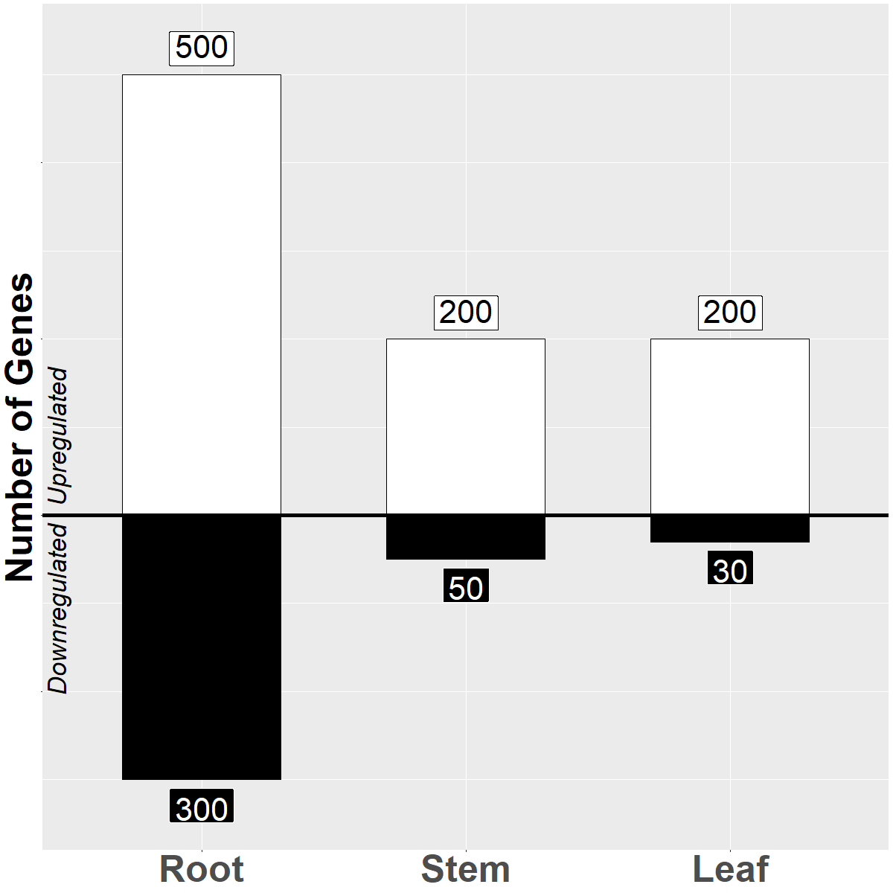
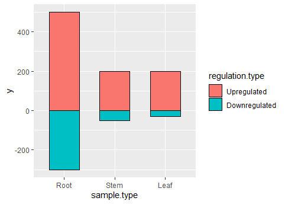
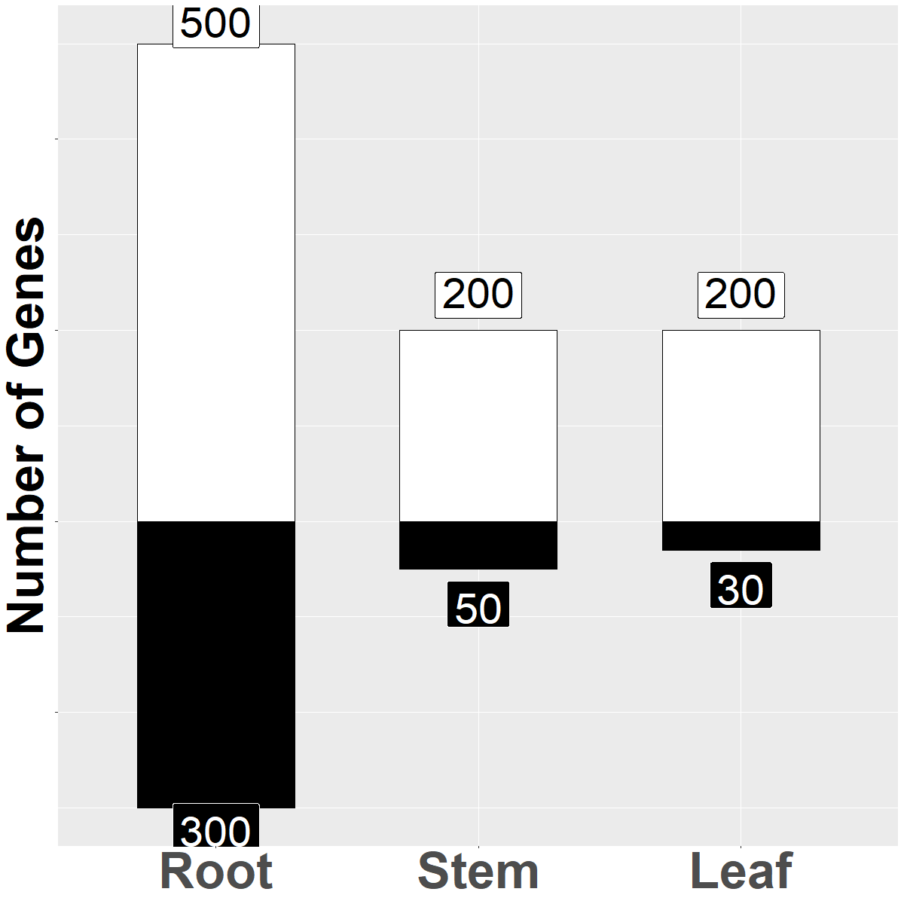
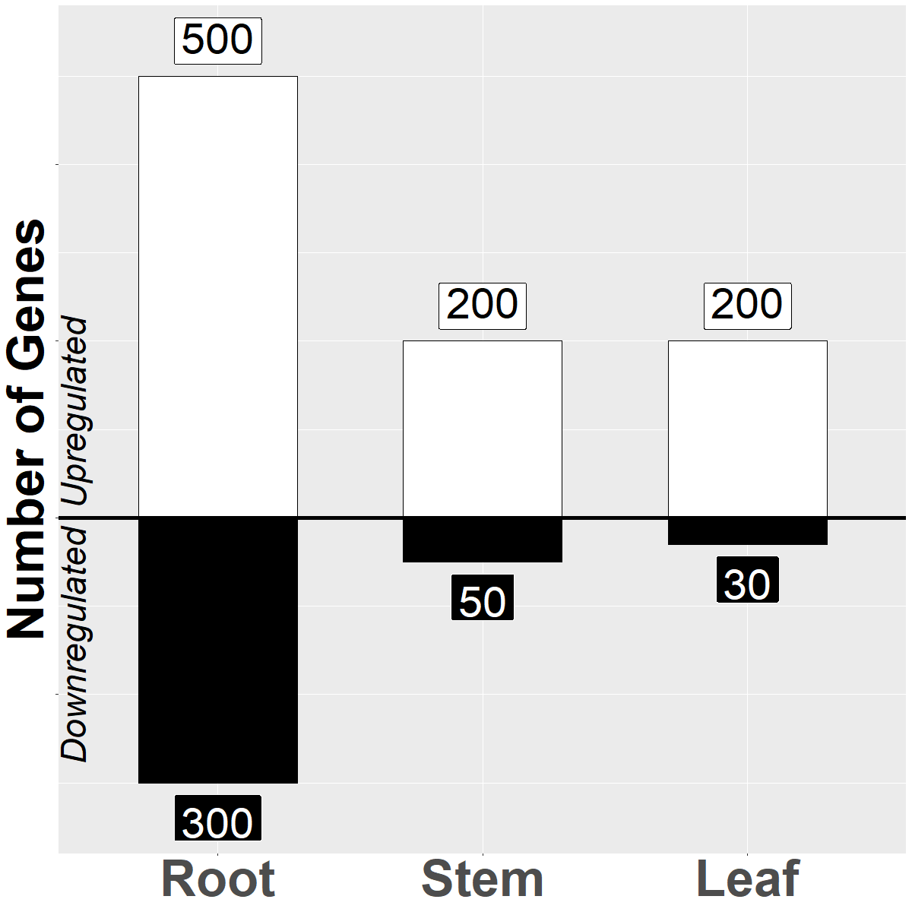

# Creating a mirrorplot in R

Throughout the process of running an RNA-seq, you may be asked to graphically represent total number of genes that are upregulated and downregulated. The mirror plot allows you to do that and has a nifty little graphic that can include in presentations:



This is created with ggplot2 and labels using ggrepel. 

Lets get into the specifics below.

## Installing libraries

As mentioned before, we'll be using ggplot2 and ggrepel.

```
library(ggplot2)
library(ggrepel)
```

## Getting the data ready

The first thing you'll want to setup are the major categories of tissue/cell types. In my example, I'm using plant tissue so:
```
sample.type1 <- c("Root", "Stem", "Leaf")
```	

Next, lets assign values. This will just be a long list of values, two for each of the categories above. The first will be positive, and the second negative reflecting up/down regulation. Because we have three categories, there will be six total elements of this list.

```
sample.values1 <- c(500, -300, 200, -50, 200, -30) 
```

Then we want to setup two lists that contain the fill colors to be used in the plot as well as the text that is going to be displayed vertically. 

```
regulation.type1 <- c("Upregulated", "Downregulated")
bar.fill1 <- c("white", "black")
label.text.color1 <- rev(bar.fill1)
maxnum <- max(sample.values1)
y.lab <- "Number of Genes" 
```

The text fill color will simply be the reversed values of the fill color since we want these to show up against the fill colors. The variable that I've setup as the `maxnum` for the dataset has an impact on the placement for the up/down regulation labels, and the y.lab is the label that will be used for the y axis.

Now, we can finally setup our dataframe

```
dat1 <- data.frame(sample.type=rep(sample.type1, each = 2), 
                  regulation.type = regulation.type1,
                  y = sample.values1, 
                  bar.fill = bar.fill1, 
                  label.text.color = label.text.color1, 
                  stringsAsFactors = FALSE)

dat1$regulation.type <- factor(dat1$regulation.type, levels = regulation.type1)
dat1$sample.type <- factor(dat1$sample.type, levels = sample.type1)
```

Will display as:

|sample.type |regulation.type |    y|bar.fill |label.text.color |
|:-----------|:---------------|----:|:--------|:----------------|
|Root        |Upregulated     |  500|white    |black            |
|Root        |Downregulated   | -300|black    |white            |
|Stem        |Upregulated     |  200|white    |black            |
|Stem        |Downregulated   |  -50|black    |white            |
|Leaf        |Upregulated     |  200|white    |black            |
|Leaf        |Downregulated   |  -30|black    |white            |

Setting the `regulation.type` and `sample.type` as ordered factors will allow them to appear in the order that you specified when you setup the lists.

## Creating the plot

Now we finally get to setup our plot. 

```
p <- ggplot(dat1, aes(x=sample.type, y=y, fill=regulation.type, label=abs(y))) + 
  geom_bar(stat="identity", position="identity", color = "black", width=.6)
```

The x axis is using our `sample.type`, the y axis the number of genes that are regulated, and we've set the future labels that will be used as the absolute values (so we won't be bothered with negative signs appearing in our plot).

Additionally, the type of chart is specified as a `geom_bar` and a black border.  

Running the code produces this plot:



Now, there are several things that we need to do to this plot to make it appear as we'd like:

1. Adjust the fill colors
2. Relabel/remove some axes
3. Add the labels for each of the bar values
4. Remove the legend

```
p <- p + scale_fill_manual(values = dat1$bar.fill) + 
  theme(axis.title.x=element_blank(),axis.text.y=element_blank(), 
        axis.title.y = element_text(size=50, face="bold"), 
        axis.text=element_text(size=50, face="bold")) +
  ylab(y.lab) +
  geom_label_repel(direction = "y", mapping = aes(hjust=.5, 
                                                  vjust = rep(c(1,0), length(sample.type1))), 
                   color = dat1$label.text.color, 
                   fill= dat1$bar.fill, size=15, 
                   label.padding = unit(.5, "lines")) +
  theme(legend.position = "none")
```

Produces the following on a 1200x1200 plot:



We're getting close, but you can see that we still have to add the vertical up/downregulation label, and the chart cuts off the labels for some of the larger values. We can fix that with:

```
p <- p + annotate(geom="text", x=.45, y=.02*maxnum, label=regulation.type1[1],
           color="black", angle=90, fontface="italic", size=12, hjust=0) +
  annotate(geom="text", x=.45, y=-.02*maxnum, label=regulation.type1[2],
           color="black", angle=90, fontface="italic", size=12, hjust =1) + 
  scale_y_continuous(expand=expansion(mult=c(.10,.10)))
```


As a finishing touch, lets add a horizontal line and call it a day!

```
p <- p + geom_hline(yintercept=0, color="black", size=2)
```


